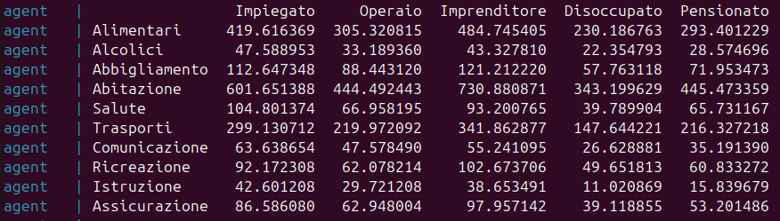

# Progetto Team 3

## Idea Dati Sintetici
**Finalità del modello:** generare dati sintetici relativi alle spese per consumi degli individui.

Sfruttando dati aggregati e pubblicamente disponibili (ISTAT) si vuole creare un modello in grado di simulare le spese mensili (o annuali) aggregate sostenute dagli individui all’interno del territorio nazionale. La spesa per consumi viene articolata nel seguente modo:

### **Voci di spesa**
- **Prodotti alimentari**

- **Prodotti non alimentari e servizi**
  - Alcolici
  - Abbigliamento
  - Abitazione
  - Salute
  - Trasporti
  - Comunicazione
  - Ricreazione
  - Istruzione
  - Assicurazione

### **Condizione professionale**
- **Occupato**
  - Dipendente
    - Impiegato
    - Operaio

- **Non occupato**
  - Disoccupato
  - Pensionato

Il formato finale si presenterà come un file TXT con all'interno i dati in formato tabulare con ogni voce sopra descritta come singola colonna e le osservazioni (i soggetti) saranno divisi in singole righe. 

---
## Descrizione Contenuto
- Docker presenti
    - docker python
    - docker ollama
- Docker-compose: crea la rete condivisa per poter far parlare i docker tra di loro localmente
- Dockerfile dello script python: crea l'immagine del docker per far girare lo script python
- Script python: comunica con l'api di ollama per sfruttare il modello installato

---

## Descrizione funzinamento grafi
**Finalità della struttra**:
Il progetto presenta una struttura gerarchica multi-agente con un agente manager che gestisce la comprensione, l'elaborazione e il controllo della generazione. Gli agenti subordinati servono principalmente per delegare le chiamate ai tool che non richiedono l'uso di un modello. Questa struttura permette l'implementazione di un modello più snello e preciso che non influisce troppo sulle prestazione e che garantisce comunque il parallelismo garantendo una buona velocità di elaborazione.

**Finalità della decisione**:
Il grafo decisionale serve come base per la definizione del loop decisionale langgraph che dovrà compiere l'agente manager. Esso dovrà comprendere l'input manuale e definire quali tool avrà bisogno e potrà accedere ad ogni tool contemporaneamente in maniera parallela così da non inficiare la velocità di elaborazione. Successivamente aggregherà i risultati e genererà la richiesta iniziale. Infine effettuerà un controllo di adeguatezza dei risultati e valuterà se sarà necessario rifare da capo la generazione o mostrare i risultati ottenuti.

